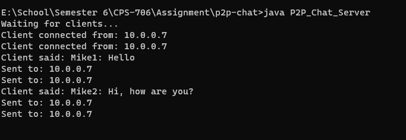
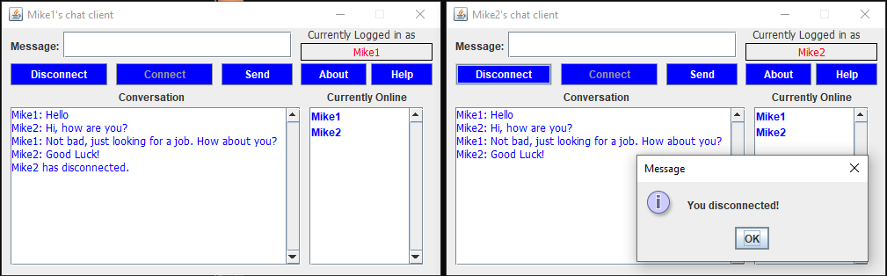

# Chat-App-JAVA-

## Screenshots


*Server running in the terminal*


*Two clients running*

## About this project
* This was the begining of a project from my computer networks class. You may notice it's a bit of a mess, and unfinished. When I started working on this project, my goal was to first get something up and running that could send messages, then refine it into somthing a little better with more features. Unfortunatly COVID happened and the project was cancelled before I could finish it.
* I managed to complete my first goal of getting something up and running, however, if you look at the source files you may notice some of the code is a bit messy (such as having client data inside the ui code).
* Finally, you may notice alot of refrence to P2P in these files, but nothing in the server code looks to be P2P. This was my first time writing networking code, and my main concern was to first get something that resembles a chat room, then turn it into what the project called for.

## How to run this code
* First you will need to get your local ip address.
  * #### Windows
  * Open a command prompt and run
    > ipconfig
  * Look for your IPv4 Address.
  * #### Linux
  * Open a terminal and run
    > ifconfig 
  * Look for inet and your ip address should follow it.
  * *Note*. ifconfig is part of the net-tools package. You may also run "ip addr"
* Copy the above address and open the file "P2P_Chat_Client_UI.java". On line 10, replace the "10.0.0.7" with your ip address.
```java
private static final String HOST_NAME = "<Your ip here!>";
```
* cd into the directory of the source files and run the command
> javac P2P_Chat_Client_UI.java P2P_Chat_Server.java
* In one terminal, run the server with the following command
> java P2P_Chat_Server
* In another terminal, run the command
> java P2P_Chat_Client_UI
* You can run a number of chat clients at the same time by opening more terminals and running the above command. Or by connect with other computers on the same network (*This program won't connect outside of the local network it's running in*).

